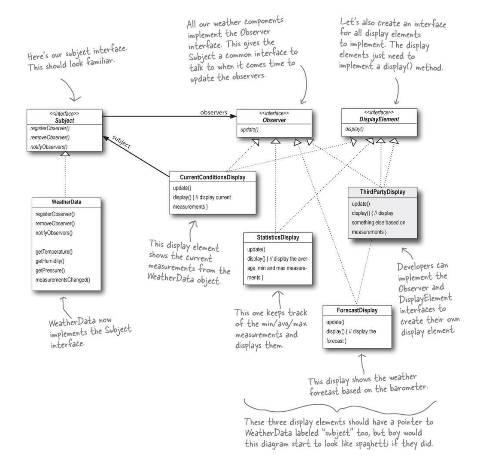

## Also known as
Dependents, Publish-Subscribe

## Intent
Define a one-to-many dependency between objects so that when one object changes state, all its dependents are notified
and updated automatically.

## Explanation

Real world example

> In a land far away lives the races of hobbits and orcs. Both of them are mostly outdoors so they closely follow the changes in weather. One could say that they are constantly observing the weather.

In plain words

> Register as an observer to receive state changes in the object.

Wikipedia says

> The observer pattern is a software design pattern in which an object, called the subject, maintains a list of its dependents, called observers, and notifies them automatically of any state changes, usually by calling one of their methods.

**Programmatic Example**

Let's first introduce the weather observer interface and our races, orcs and hobbits.

```java
public interface WeatherObserver {

     void update(int temperature, int humidity, int pressure);
}

public class StatisticDisplay implements Observer {
    @Override
    public void update(int temperature, int humidity, int pressure) {
        System.out.println("Update StatisticDisplay display with new Parameters");
    }
}


public class GeneralDisplay implements Observer {
    @Override
    public void update(int temperature, int humidity, int pressure) {
        System.out.println("Update general display with new Parameters");
    }
}

```

Then here's the weather that is constantly changing.

```java

public interface Subject {

    void registerObserver(Observer observer);

    void removeObserver(Observer observer);

    void notifyObserver();

}

public class WeatherData implements Subject {

    private List<Observer> observers;

    public WeatherData() {
        this.observers = new ArrayList<>();
    }

    @Override
    public void registerObserver(Observer observer) {
        observers.add(observer);
    }

    @Override
    public void removeObserver(Observer observer) {
        observers.remove(observer);
    }

    @Override
    public void notifyObserver() {
        observers.forEach(observer -> observer.update(getTemperature(), getHumidity(), getPressure()));
    }

    int getTemperature(){
        // some code here
    }

    int getHumidity(){
        // some code here
    }

    int getPressure(){
        // some code here
       
    }

}
```

Here's the full example in action.

```java
        WeatherData weatherData = new WeatherData();

        weatherData.registerObserver(new GeneralDisplay());
        weatherData.registerObserver(new StatisticDisplay());

        weatherData.notifyObserver();
   
```

## Class diagram


## Applicability
Use the Observer pattern in any of the following situations

* When an abstraction has two aspects, one dependent on the other. Encapsulating these aspects in separate objects lets you vary and reuse them independently
* When a change to one object requires changing others, and you don't know how many objects need to be changed
* When an object should be able to notify other objects without making assumptions about who these objects are. In other words, you don't want these objects tightly coupled

## Typical Use Case

* Changing in one object leads to a change in other objects

## Real world examples

* [java.util.Observer](http://docs.oracle.com/javase/8/docs/api/java/util/Observer.html)
* [java.util.EventListener](http://docs.oracle.com/javase/8/docs/api/java/util/EventListener.html)
* [javax.servlet.http.HttpSessionBindingListener](http://docs.oracle.com/javaee/7/api/javax/servlet/http/HttpSessionBindingListener.html)
* [RxJava](https://github.com/ReactiveX/RxJava)

## Credits

* [Design Patterns: Elements of Reusable Object-Oriented Software](https://www.amazon.com/gp/product/0201633612/ref=as_li_tl?ie=UTF8&camp=1789&creative=9325&creativeASIN=0201633612&linkCode=as2&tag=javadesignpat-20&linkId=675d49790ce11db99d90bde47f1aeb59)
* [Java Generics and Collections](https://www.amazon.com/gp/product/0596527756/ref=as_li_tl?ie=UTF8&camp=1789&creative=9325&creativeASIN=0596527756&linkCode=as2&tag=javadesignpat-20&linkId=246e5e2c26fe1c3ada6a70b15afcb195)
* [Head First Design Patterns: A Brain-Friendly Guide](https://www.amazon.com/gp/product/0596007124/ref=as_li_tl?ie=UTF8&camp=1789&creative=9325&creativeASIN=0596007124&linkCode=as2&tag=javadesignpat-20&linkId=6b8b6eea86021af6c8e3cd3fc382cb5b)
* [Refactoring to Patterns](https://www.amazon.com/gp/product/0321213351/ref=as_li_tl?ie=UTF8&camp=1789&creative=9325&creativeASIN=0321213351&linkCode=as2&tag=javadesignpat-20&linkId=2a76fcb387234bc71b1c61150b3cc3a7)
